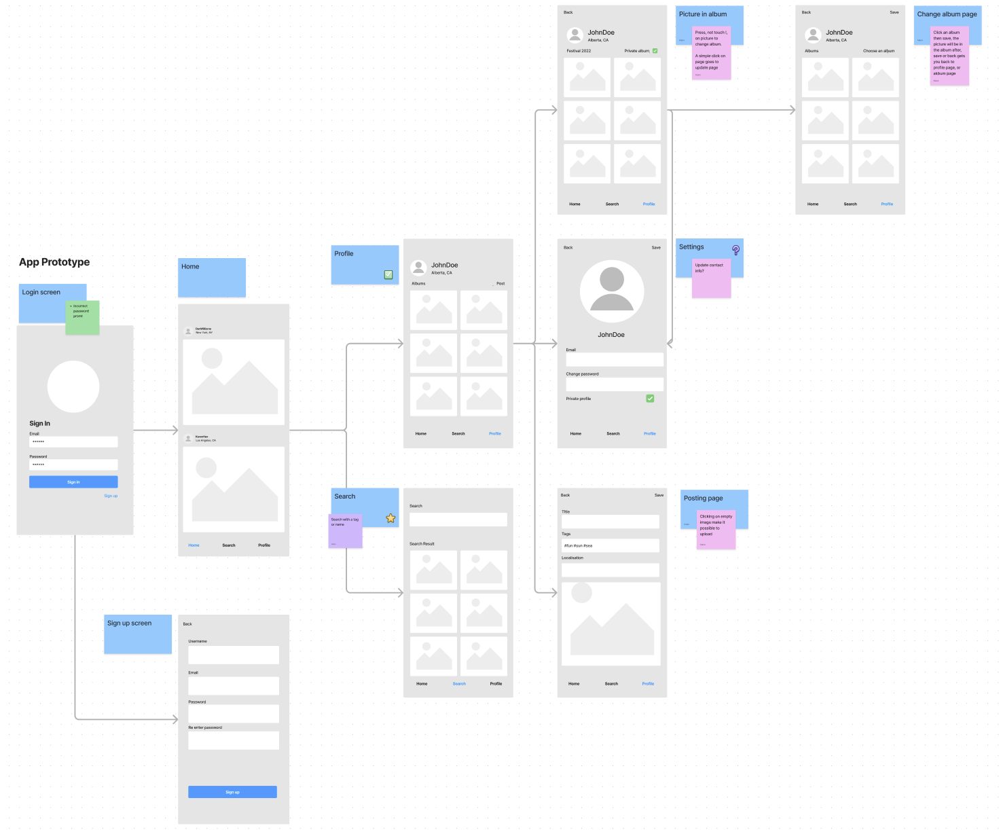
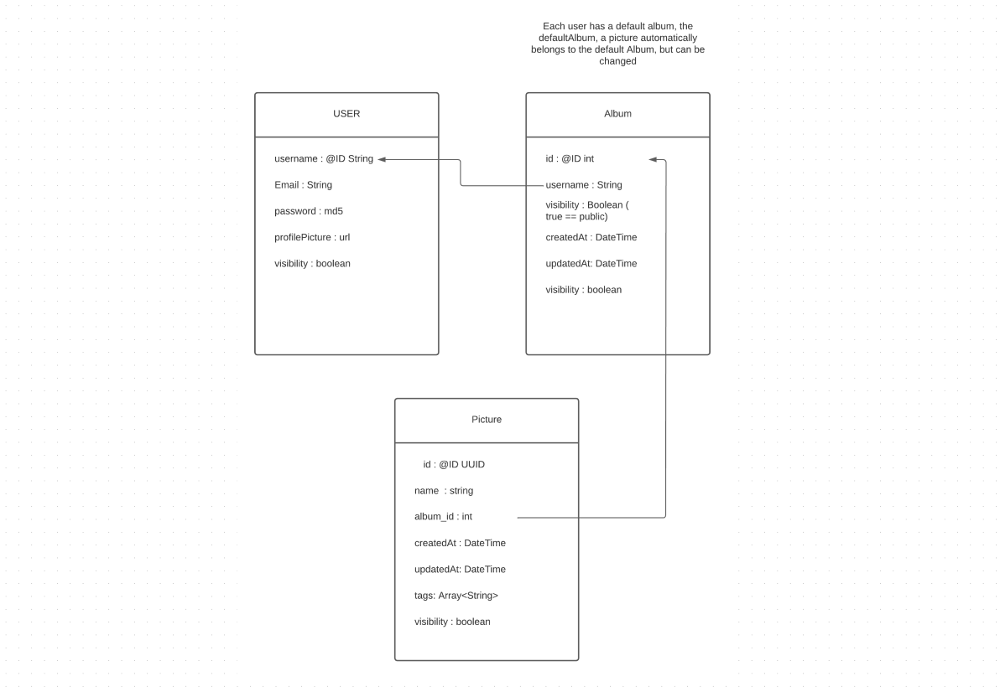
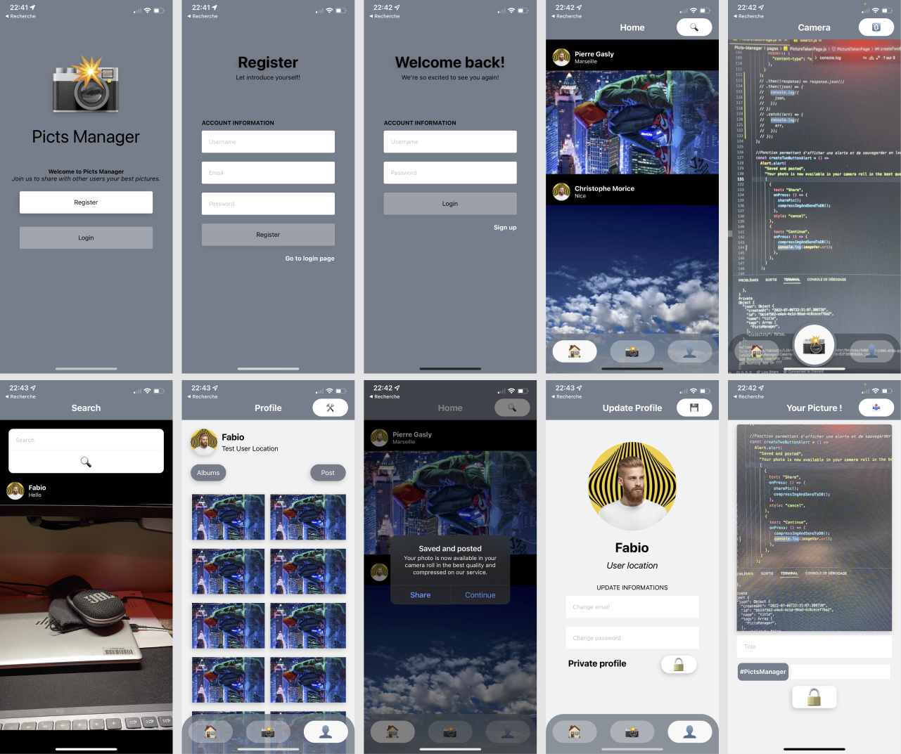

# Picts Manager

Le but de ce projet était de conceptualiser un rapide réseau social qui avait pour fonctionnalité clef la compression d'image du côté Front avant d'être envoyé sur le Back.
Ce projet résulte de mes premiers pas en JS et plus particulièrement en React Native couplé à Expo.

## Run Locally

Clone the project

```bash
  git clone https://github.com/djsfabio/Picts-Manager
```

Go to the project directory

```bash
  cd Picts-Manager
```

Install dependencies

```bash
  npm install
```

Start the server

```bash
  npm run start
```

## Application Mobile

Application mobile développée en React Native et testée pour le moment directement grâce à Expo.

## Back-End

Partie Back-End non fournie dans ce repo car non développée par moi-même.

## Features

- Publication de la photo avec titre, privacy et hashtags
- Compression de la photo directement depuis le front
- Login et Register de User
- Search de photos possible grâce aux users et hashtags
- Update des informations utilisateurs possibles
- Enregistrement en local de la photo origale (pré-compression) et de la photo post-compression
- (Non intégrée) Possibilité de créer et compléter des albums avec les photos prises par l'utilisateur

## Concept of the app



## Database schema



## Screenshots of the app



### Library used

- [Utilisation d'image manipulator pour la compression](https://docs.expo.dev/versions/latest/sdk/imagemanipulator/)

## Used By

Utilisé lors du projet Epitech nommé "Picts-Manager"
